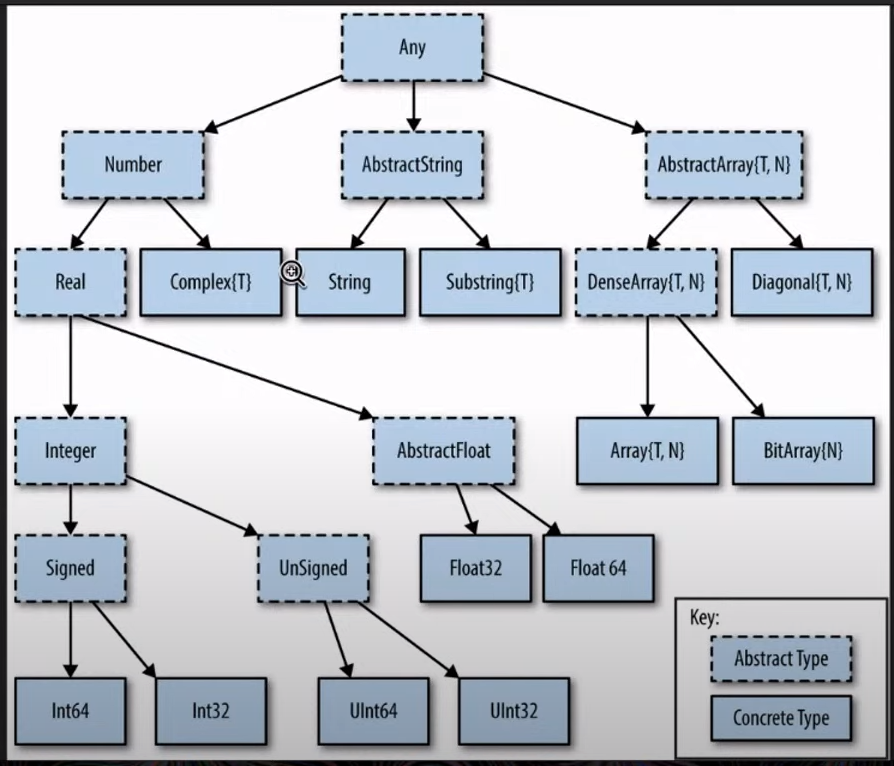

# My Notes

Notes on the basics of Julia for newbies based on the following video. <br> https://www.youtube.com/watch?v=uiQpwMQZBTA&ab_channel=TheJuliaProgrammingLanguage

## Extensions

These are w.r.t VS Code.
Use the following Extensions

- Julia: To install the REPL and syntax capabilities to VS code. <br> Note that Julia has to installed separately as normal. This does not install Julia.

- Julia Formatter: To format the Julia code, as per the developers norms. Recommended by the tutor.

---


## Execute

- To start a new REPL through VS Code,  either use command pallete to Start a REPL
    - Alternaltively use short cuts like `Alt+J Alt+O` to open a REPL, `Alt+J Alt+K` to kill a REPL and `Alt+J Alt+R` to restart a REPL.
- To execute the entire .jl file use `Alt+Enter`
- To execute a line and move forward use `Ctrl+Enter` or `Shift+Enter`
- To enter help mode in REPL, press `?`. <br> Then you can type any function to find out the information on that.

---

## Pkg manager

- `]` to enter the package manager
- Backspace or Ctrl+C to exit the package manager
- add package BenchmarkTools using the command `add BenchmarkTools` in pkg mode.
- add particular version using the command `add BenchmarkTools@1.2.0` in pkg mode.
- remove a package using `rm BenchmarkTools` in pkg mode.

Project.toml and Manifest.toml contain the information about your environment and your packages.

- To see the help with `status` command in pkg mode, type `help st` in pkg mode.
- To see the Manifest.toml type `st -m` in pkg mode
    - Manifest.toml contains the information about your packages and your dependencies.

For advanced questions regarding package manager, visit https://pkgdocs.julialang.org/v1/

- For updating all your packages, type `up` in pkg mode.
- For updating a specific package, type `up BenchmarkTools`

Garbage collect is a command to remove unused packages. <br>
Use command `help gc` for more details.

Modules, packages and types in Julia are camelcase. <br>
BenchmarkTools <br>
Float64 <br>
and so on.

Function are not necessarily camelcase. <br>
eg: isconcretetype()

---

## Boolean

- `&&` AND
- `||` OR
- `!` NOT
- `&` Bit-wise AND
- `|` Bit-wise OR
- `==` Equality check
- `!=` Not equals check
- `<=` Less-than equal
    - Alternatively `\le` like Latex, and it will do it with a symbol for less-than equal to.

---

## Variables

- To check the type of variable use `typeof(var)`
- To specify things use <br> 
```
x = 314
y = 3.14
str = "Hello"
aCharVar = 'c'
```
- For string, you have to use double quotes. Single-quotes are reserved for char types (single characters).
- You can use variables like &alpha; and others in Julia natively.
    - The command is similar to Latex.
- **Note**: In Julia, trings are not vectors of chars. However it is still possible to index the string. <br>
```
myStr = "Hello"
myCh = ['H', 'e', 'l', 'l', 'o']
```
Here myStr and myCha are not the same.<br>
However, you can still do `myStr[2]` to get `e`.

#### varinfo()
To find out list of all variables defined currently in Julia use `varinfo()`

#### methodswith()
Use this to find out all functions that use a particular type.

---


## Types

Something called Abstract types and Concrete types.

|  |
| -------- |
| Fig: Types in Julia |

The dashed types in the above figure are Abstract tpes and the solids are concrete types.

#### varinfo()
To find out list of all variables defined currently in Julia use `varinfo()`

#### supertypes(type) / supertype(type)
To get the super type (Abstract type) of the current type.

#### subtypes(type) / subtype(type)
To get the sub type (usually Concrete type) of the current type.

#### isa / isconcretetype / isabstracttype
To check if the object is of the specified type. <br>
`x isa Real`

#### Base.summarysize(var)
To get the storage (in Bytes) for the object.

---

## Containers

Contained in `[]`. <br>
Non-technical definition, a type that holds other types.

```
x_vec=[1,2,3,4]
4-element Vector{Int64}:
 1
 2
 3
 4
 ```

Containers are objects containing multiple objects. <br>
It is identified using the curly brackets, as noted in the Vector{Int64}.<br>

**Note**:
The type of the container is the type of the objects in the container.<br>
So if you take x_vec from the above code, where the container is Int64 type and try to add a Float, it will convert that to a Int. <br> Alternatively, if you add a string to the container, then it will throw an error.

If you mix types of objects in the container, then the overall type of the container will be any, as seen below.<br>
However, this is note recommended. This will slow the background processing down and disable the backgroun optimisations.
```
x_mult = [1, "Hello", 'c', 3.14]
4-element Vector{Any}:
 1
  "Hello"
  'c': ASCII/Unicode U+0063 (category Ll: Letter, lowercase)
 3.14
 ```

---

## Conditional statements

Same as FORTRAN.

```

if condition
...
elseif condition
...
else
...
end
```

---

## Looping

```
for i in [1,3,4,5,6]
    println(i)
end

for i in 1:2:10
    println(i)
end
```

**Note**: For writing big numbers you can add breaks using underscore
`1_000_000 = 1000000`

```
while condition
...
end
```

---


## Function and Methods

Its best to look here in the documentation.<br>
https://docs.julialang.org/en/v1/manual/functions/

```
function function_name()
...

return Any
end
```

#### Short Function
```
short_function() = "Very short function"
```

#### Position arguments and keyword arguments

- Poisition and keyword arguments are separated by `;`
- Position arguments have to specified in the correct order. Keyword arguments can be given in any order.
- It is possible to specify the type of both positional and keyword arguments. By default they will be as _Any_ arguments.
- If you specify a default value for the keyword argument, then its optional during the call.
- You can also do default vallues for position arguments.

```
function fnc_with_Keywords(x::Float64, y; key1=10, key2::Float64=20.0)
    return( sum([x, y, key1, key2]) )
end
```

### Return type

You can also specify the return type


### Multiple dispatch

- A function can be called with multiple methods. This is called multiple dispatch.
- This is what makes Julia very powerful. Its like function overloading in C++, but much more powerful (apparently).
- you can use the commands `methods(abs)` to list all the methods for a function.


---

## Structs

Julia has no classes. <br>
But it has structs, similar to FORTRAN and C++.

Refer to the codde 09-struct.jl for info.